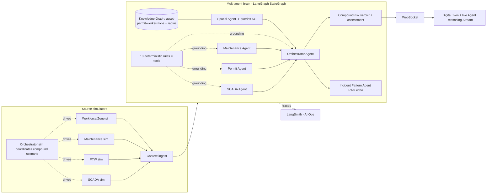

# Agentic Safety Intelligence Pivot

## Why this pivot

This is an *AI* hackathon whose suggested tech lists **Agentic AI / Multi-Agent Systems first**, and whose flagship example ("Compound Risk Detection Engine") is explicitly a multi-agent system. The current design deliberately did the opposite: 13 deterministic rules do all detection, one LLM call only summarizes, and [`docs/execution-decisions.md`](docs/execution-decisions.md) even locks it as "do not reopen into agentic tool-calling." We hit ~1.5 of 6 suggested techs. The fix is **not a rebuild** — the twin, state machine, review/decision/evidence flow, pgvector RAG, and simulator are the right substrate. We replace the *intelligence layer* with a real, visible multi-agent brain and let everything else become its stage.

## Target architecture (evolve, keep substrate)

**Grounding principle (keep the trust story):** agents reason, but hard facts (gas > threshold, permit overlap, isolation state) come from the existing deterministic rules exposed as **tools**. A BLOCK verdict must be backed by a deterministic rule output, so the AI reasons but never fabricates a safety fact. This is our answer to "how do we trust the agents."

## Key decisions (baked in; flag to override)

- **Orchestration:** **LangGraph** `StateGraph` — each agent is a node over a shared `AgentState`; conditional edges let the Orchestrator route to the Incident Pattern / shift-handover agents. The existing asyncio worker in [`backend/app/assessment/orchestrator.py`](backend/app/assessment/orchestrator.py) invokes the compiled graph and forwards `astream_events` steps to the existing WebSocket broadcast. Recognized framework + native streaming, no bespoke orchestration to maintain.
- **Observability / AI Ops:** **LangSmith** — automatic tracing of every agent/LLM call (latency, tokens, cost, run replay). This replaces the SQL-aggregate AI Ops story; the in-app [`/ai-ops`](frontend/app/ai-ops/page.tsx) cards stay as a light summary, LangSmith is the deep view for Q&A/demo.
- **LLM access:** LangChain chat models — `langchain-openai` (paid API, primary for demo) with `langchain-ollama` offline fallback. The bespoke clients in [`backend/app/assessment/providers/`](backend/app/assessment/providers) are superseded on the agent path by LangChain models (so LangSmith traces them); structured output via `.with_structured_output`.
- **Knowledge graph:** built in-process (networkx) from existing Postgres relational data + the 2D coordinates already in [`frontend/lib/floor_plan_map.json`](frontend/lib/floor_plan_map.json) (reuse for spatial radius — no new geodata needed). Neo4j is an explicit non-goal.
- **New dependencies:** `langgraph`, `langchain`, `langchain-openai`, `langchain-ollama`, `langsmith`, `networkx`.
- **Kept as-is:** review state machine, decisions/evidence, reports, notifications, twin shell, pgvector RAG retrieval + deterministic fallback.

## Protect-under-pressure order (4 days)

1. Multi-agent compound-risk engine + live reasoning stream (the hero).
2. Knowledge graph + Spatial Agent radius correlation.
3. Simulator split into source sims + orchestrator sim.
4. Incident Pattern Agent (RAG echo) surfaced in the trace.
5. Generative shift-handover brief.
6. Polish: KG visualization, provider/latency tuning, demo choreography.

Cut from the bottom up. Items 1-3 are the winning core.