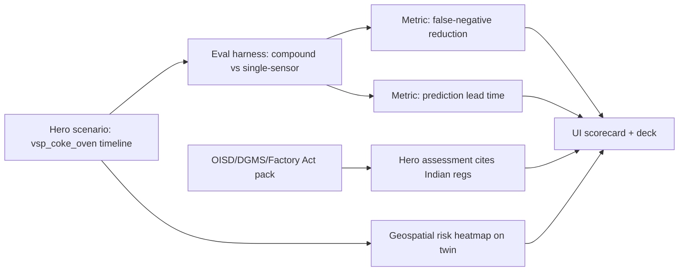

# Compound Risk, Caught In Time — One-Story Plan

## The one story (everything supports this)

Recreate the Visakhapatnam coke-oven pattern from the problem context: gas rising + active hot-work permit + incomplete isolation + a worker in-zone. Each individual sensor stays *below its own critical alarm*, so single-sensor monitoring stays silent (false negative). SOP Opera fuses the sub-critical signals, raises a **blocking** compound verdict **minutes/hours before** any single sensor would trip, cites **OISD / Factory Act / DGMS**, and shows the risk spreading on the plant map.

Every deliverable below exists to make that one demo provably better with a number. We are explicitly **not** adding CCTV, an Emergency Orchestrator agent, or a separate Compliance Audit agent — breadth dilutes the story.

## How the metric works (the defensible core)

- Give each sensor two thresholds: the existing **elevated** threshold (already in [backend/app/core/config.py](backend/app/core/config.py), e.g. `gas_elevated_threshold`) and a new higher **critical/incident** threshold.
- **Single-sensor baseline** = alarm fires only when *one* sensor crosses its *critical* threshold (OR of criticals). This is today's plant.
- **Compound engine** = existing fusion in [backend/app/agents/nodes/orchestrator.py](backend/app/agents/nodes/orchestrator.py) (`_fuse_risk`, `COMPOUND_TRIO`, `>=3` facts, spatial hit) fires on co-occurring *elevated* (sub-critical) facts.
- **False negative** = case that is truly dangerous but no single sensor hits critical → baseline misses, compound catches. This is exactly the challenge's life-saving metric.
- **Lead time** = (time single-sensor critical would trip) − (time compound verdict fires) along the scenario timeline.

## Phase 0 — Hero scenario + threshold model

- Add `backend/app/simulator/scenarios/vsp_coke_oven.yaml`: a timed sequence (gas creeping up, hot-work permit issued, isolation unconfirmed, worker enters zone) modeled on the existing [backend/app/simulator/scenarios/compound_risk.yaml](backend/app/simulator/scenarios/compound_risk.yaml).
- Add `*_critical` thresholds to [backend/app/core/config.py](backend/app/core/config.py) (gas, temp) as the "incident threshold" line.
- This scenario becomes the single demo path and the primary labeled positive case for the harness.

## Phase 1 — Evaluation harness: compound vs single-sensor + FN rate (headline)

- New `backend/app/eval/` module:
  - `dataset.py`: labeled scenario cases (compound-positive like VSP, single-signal negatives, benign noise) reusing `ContextEntryView` from [backend/app/context/derived_facts.py](backend/app/context/derived_facts.py).
  - `baselines.py`: `single_sensor_detector` (OR of per-sensor critical thresholds) vs `compound_detector` (wraps `evaluate_rules` + `_fuse_risk`).
  - `metrics.py`: confusion matrix → accuracy, recall, **false-negative rate**, plus per-case detail.
  - `run.py`: emits a JSON/markdown report (`docs/eval-report.md`).
- Tests in `backend/tests/test_eval_harness.py` asserting compound FN rate < single-sensor FN rate on the dataset.
- This is the number that wins Business Impact + Innovation.

## Phase 2 — Prediction lead time

- Extend the harness to replay each scenario over its timeline and record `t_compound_alarm` vs `t_single_sensor_critical`; report mean/median **lead time** per case.
- Surface lead time on the live assessment: add a `lead_time_seconds` style field to the orchestrator verdict detail in [backend/app/agents/nodes/orchestrator.py](backend/app/agents/nodes/orchestrator.py) so the UI can show "flagged N min before threshold."

## Phase 3 — OISD / DGMS / Factory Act regulatory pack

- Extend `REGULATIONS` (and relevant `SOPS`) in [backend/app/db/seed_embeddings.py](backend/app/db/seed_embeddings.py) with Indian codes mapped to the compound facts:
  - OISD-GDN-116/106 (fire prevention / work permit) → `elevated_gas`, `permit_conflict`
  - Factory Act 1948 §§ 21–41 (hazardous process / safety) → `zone_occupied`, `ppe_noncompliance`
  - DGMS gas-monitoring circular → `elevated_gas`, `incomplete_isolation`
- Result: the hero assessment cites OISD/Factory Act/DGMS by code, directly scoring regulatory coverage. Existing generic codes stay as supporting corpus.

## Phase 4 — Geospatial risk heatmap (supporting evidence)

- Add a dynamic risk overlay on the Digital Twin driven by live derived facts + spatial proximity (reuse [frontend/lib/floor_plan_map.json](frontend/lib/floor_plan_map.json) and the spatial KG). Assets/zones intensify as compound conditions accumulate; the gas→hot-work proximity link is drawn explicitly.
- Keep it an overlay on the existing twin ([frontend/components/twin/DigitalTwin.tsx](frontend/components/twin/DigitalTwin.tsx)), not a new page — it visualizes the same hero event.

## Phase 5 — Story surface: scorecard + deck alignment

- Add a compact "Compound vs Single-Sensor" scorecard in the frontend (FN reduction %, mean lead time, regs cited) sourced from the eval report, so judges see the metric live.
- Refresh the evaluation canvas and draft deck talking points so architecture diagram, demo video, and metrics all tell the same single story.

## Out of scope (deliberately, to protect the story)

- No CCTV / computer vision (framed as roadmap).
- No autonomous Emergency Response Orchestrator or standalone Compliance Audit agent — compliance is covered via the regulatory pack + existing assessment citations.
- No real SCADA/IoT integration; the ContextProvider seam stays the documented extension point.