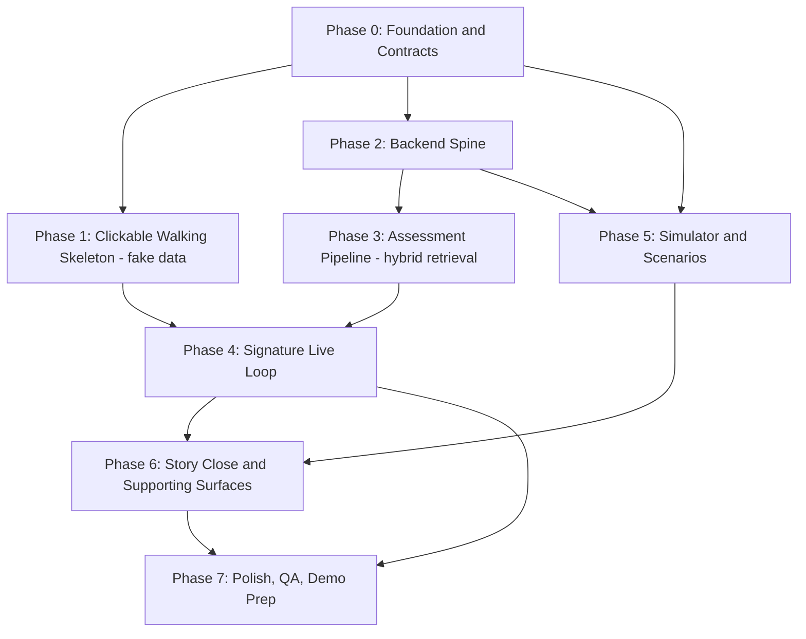

# SOP Opera - Phase-Based Build Plan

Reference docs: [Technical Design Spec](docs/Technical%20Design%20Spec.md), [Execution Decisions](docs/execution-decisions.md), [Project Overview](docs/project-overview.md), [Implementation Guide](docs/implementation-guide.md).

**Pre-build amendment:** Derived Facts expanded 3 → 6; retrieval is hybrid (RAG primary + quality gate + deterministic fallback) under Orchestrator control. Compound Risk still depends on the three canonical facts.

## How this plan works

- **Phases, not days.** Each phase is a significant, mostly independent slice. You can collapse or reorder them if you pivot.
- **Clickable-first.** Phase 1 produces a fully navigable frontend on fake data so you can eyeball the whole product before any backend logic exists. This is your pivot checkpoint.
- **Anti-blocking rule.** Every dev builds against two shared things frozen in Phase 0: the `shared/` contracts and mock/fixture data. Frontend never waits on backend; simulator never waits on backend internals; supporting views render from sample payloads. Nobody is blocked on anyone else's unfinished work.
- **Solo-capable critical path.** Phases 0 -> 2 -> 3 -> 4 are the spine and can be executed by one person. Everything else is an accelerator that plugs in when other hands are free.
- **Workload sized for 5 intense days; 10-day calendar gives buffer** for depth, RAG threshold tuning, the real AI provider, and rehearsal.

## Dev domains (strict separation, no shared files)

- **Dev 1 - Core Systems.** Backend spine (Review state machine, Context Engine, Derived Facts, Audit), the Assessment pipeline (Orchestrator, hybrid retrieval, providers, embeddings, validation, Manual Assessment), and the Decision + Evidence-freeze backend. Owns the critical path.
- **Dev 2 - Product Experience.** Entire frontend: app shell, Digital Twin rendering, reasoning-trace panel (incl. retrieval path/score), Assessment panel, Decision UI, WebSocket client. Builds against contracts + mock data, then swaps to live.
- **Dev 3 - Simulation & Demo Engine.** YAML Scenario DSL, the three scenarios, Demo Mode controls, deterministic replay. Talks to the backend only through the `POST /context` contract.
- **Dev 4 - Enablement & Supporting Surfaces.** Seed/fixture data (`knowledge_chunks` corpus text), floor-plan SVG + `floor_plan_map.json`, read-only Reports view, Notifications panel, AI Ops dashboard, QA run-throughs, and the demo script. Broad exposure across the system with low cross-dependency.

## Phase dependency map

The critical path is P0 -> P2 -> P3 -> P4 (Dev 1), joined by P1 (Dev 2) at the integration point in P4.

---

## Phase 0 - Foundation and Contracts
**Goal:** Freeze the seams so all four domains can move without colliding.
**Owner:** Dev 1 leads; Dev 2 mirrors types; Dev 4 stubs fixtures + corpus text.
- `shared/` package: `schemas`, `enums`, `api_contracts` from TDS Section 8 (Context, DerivedFact, Recommendation, Assessment with `assessment_type`, Decision, Review, ManualAssessmentIn, **RetrievedReference** with `retrieval_path` / `score` / `chunk_id`).
- `backend/app/db/schema.sql` + `seed.py` skeleton from TDS Section 9 tables — include `CREATE EXTENSION IF NOT EXISTS vector;` and **`knowledge_chunks`** (id, source_type, source_id, chunk_text, embedding, applies_to_category, token_count).
- `.env` config strategy (Pydantic Settings): active AI provider, thresholds, retry counts, simulator timing, **plus RAG/embeddings** — `RAG_ENABLED`, `EMBEDDING_PROVIDER`, `EMBEDDING_MODEL`, `EMBEDDING_DIM`, `RAG_TOP_K`, `RAG_SCORE_THRESHOLD`, `RAG_TIMEOUT_MS`.
- Skeleton FastAPI + Next.js apps talking over one dummy REST endpoint + one WebSocket echo.
- A committed `fixtures.json` sample payload set (assets, a review, an assessment, derived facts, sample RetrievedReferences with path/score) that frontend and supporting views render against.

**Viewable outcome:** both apps boot; frontend fetches the dummy endpoint; WS echoes a message.
**Exit criteria:** contracts imported by both sides; schema (incl. pgvector + knowledge_chunks) applies clean on startup/reset.

---

## Phase 1 - Clickable Walking Skeleton (fake data)
**Goal:** The entire product is navigable on fixtures so direction is visible and pivotable.
**Owner:** Dev 2 (frontend); Dev 4 (SVG asset + `floor_plan_map.json` + fixtures).
- App shell + routing that **opens directly on the Digital Twin in Demo Mode** (per Execution Decisions).
- `DigitalTwin.tsx`: static SVG floor plan, clickable/highlightable assets, side panel (`AssetPanel.tsx`) showing fixture Context/Evidence/Incident.
- Reasoning-trace panel laid out top-to-bottom (Asset → Context → Derived Facts → Retrieved References → Assessment → Recommendations → Decision) using fake data — **References node shows path + score placeholders**.
- `ReviewList` / `ReviewDetail`, `AssessmentPanel`, `DemoModeBar` shell (buttons present, wired later).
- Fake "scenario" animation toggling asset highlight states (nominal/elevated/blocking) purely client-side.

**Viewable outcome:** you can click through the whole app, watch an asset go to blocking, open the reasoning trace, and see a decision screen - all on fake data. **This is the pivot checkpoint.**
**Exit criteria:** every primary screen reachable; no backend dependency.

---

## Phase 2 - Backend Spine
**Goal:** The real engine: state, context, derived facts, audit, realtime.
**Owner:** Dev 1.
- `reviews/state_machine.py`: `transition_review(review_id, event)` as the only writer of `reviews.state`; full state set (Opened, Assessing, Pending Decision, Decided, Closed, Escalated, Reopened) with a defined `ReviewEvent` enum.
- `context/`: `ingest_context()` + `ManualInputProvider`; `POST /context`, `GET /assets/{id}/context`.
- `context/derived_facts.py`: **six rules** —
  - Canonical (Compound Risk): `rule_elevated_gas`, `rule_permit_conflict`, `rule_zone_occupied`
  - Beyond-PS: `rule_incomplete_isolation`, `rule_simultaneous_ops`, `rule_certification_expiring`
  - Computed synchronously on ingest, persisted. Seed context shapes that can trigger the new three (isolation status, adjacent work_type, cert expiry).
- `audit/service.py`: insert-only audit entry on every transition.
- `realtime/connection_manager.py`: single `broadcast(event)`; `review.status_changed` fires on transitions.
- `POST /reviews`, `GET /reviews`, `GET /reviews/{id}`.

**Viewable outcome:** headless but demonstrable - curl a context event, watch derived facts persist (including a non-PS fact), a review transition, and a WS event broadcast.
**Exit criteria:** context → derived facts (all six wireable) → state change → WS event proven end-to-end without AI.

---

## Phase 3 - Assessment Pipeline (hybrid retrieval)
**Goal:** Produce validated, explainable assessments with defensible retrieval.
**Owner:** Dev 1 (pipeline); Dev 4 assists with corpus chunk text for seeding.
- `assessment/orchestrator.py`: owns `should_reassess()`, picks up `status = pending` jobs (in-process asyncio), builds retrieval query from Derived Facts + review type + asset category, builds prompt from Derived Facts + Context refs + retrieved references.
- `assessment/retrieval/`:
  - `rag.py` — `RagRetriever` (embed query, pgvector cosine top-k over `knowledge_chunks`, hard timeout ~3s)
  - `deterministic.py` — `RETRIEVAL_RULES` SQL fallback for all six fact types
  - `__init__.py` — facade: RAG → `assess_retrieval_quality()` → fallback on weak/empty/timeout/error
- `assessment/embeddings/`: OpenAI-compatible primary, local fallback, **mock** for offline/CI.
- `db/seed_embeddings.py`: chunk regulations / incidents / SOPs → pre-embed into `knowledge_chunks` (deterministic for demo replay).
- Providers: `mock.py` **first** (deterministic, unblocks everything), then `openai_compatible.py` (primary), then `ollama.py` (fallback). Selection via `.env`.
- Structured-output validation + one retry with repair instruction, then visible `failed`.
- `assessment/manual.py` + `POST /reviews/{id}/assessments/manual`: Manual Assessment so every Decision stays backed by an Assessment.
- AI observability metadata on every attempt: include `retrieval_mode`, `retrieval_quality`, `retrieval_score`, `embedding_model`.

**Viewable outcome:** review enters Assessing → hybrid retrieval runs (path visible in metadata) → assessment (mock) completes → Pending Decision → `assessment.completed` WS event; failure path yields a visible failed state + manual path; can force RAG off and still succeed via deterministic fallback.
**Exit criteria:** mock path solid; deterministic fallback solid; RAG path returns schema-valid refs when corpus+embeddings present; at least the OpenAI-compatible provider returns a schema-valid assessment.

---

## Phase 4 - Signature Live Loop (the money shot)
**Goal:** The end-to-end interaction the demo is built around, on real backend state.
**Owner:** Dev 1 (Decision + Evidence backend) + Dev 2 (live frontend wiring).
- Frontend swaps mock data for the live WS stream (`useRealtimeEvents.ts`); twin highlight derives from latest Assessment + active Derived Facts.
- Reasoning-trace panel bound to real Context/Derived Facts/Assessment/**Retrieved References** (show `retrieval_path` + `score`).
- `decisions/`: `POST /reviews/{id}/decisions` with outcomes `approved` / `approved_with_conditions` / `blocked`; per-recommendation dispositions; `conditions` required when approved_with_conditions.
- Evidence freeze: on Decision submit, snapshot cited Context + Assessment into the immutable `evidence` row.

**Viewable outcome:** a real context change lights up the twin live, you click the asset, read the trace (including RAG or deterministic refs), and submit a Decision that freezes Evidence.
**Exit criteria:** full loop runs on the real backend with no fixtures.

---

## Phase 5 - Simulator and Scenarios
**Goal:** Drive the real loop from scripted, reproducible scenarios.
**Owner:** Dev 3.
- `simulator/engine.py`: YAML Scenario DSL parser + deterministic timed replay emitting via `POST /context`.
- `scenarios/gas_leak.yaml`, `permit_conflict.yaml`, `compound_risk.yaml` (the signature sequence in TDS Section 12 — still the three canonical facts).
- Optional stretch: one short scenario or compound step that surfaces incomplete isolation / SIMOPS / cert — not required for hero demo.
- Demo Mode endpoints: `POST /demo/scenarios/{name}/start`, `POST /demo/reset`, `GET /demo/scenarios`; wire `DemoModeBar`.

**Viewable outcome:** click "Start Compound Risk" -> gas rises, worker enters zone, permit activates -> twin escalates to blocking -> assessment blocks - all automatic and identical every run.
**Exit criteria:** all three scenarios reproducibly drive real Reviews.

---

## Phase 6 - Story Close and Supporting Surfaces
**Goal:** Give the demo its business-outcome ending and the secondary screens.
**Owner:** Dev 4 (Reports view, Notifications panel, AI Ops dashboard) + Dev 1 (report generation on closure) + Dev 2 (evidence/audit record view).
- `reports/generator.py`: one report per closure event; `ReportsView.tsx` read view.
- `notifications/`: react to domain events over WS; `NotificationsPanel.tsx`.
- `AIOpsDashboard.tsx`: read-only aggregates — Success Rate, Failed, Validation Failures, **RAG Hit Rate**, **RAG Fallback Rate**, **Mean Retrieval Relevance**.
- Evidence/audit record view completing Decision → Evidence frozen → Report → audit record.
- Confirm reasoning-trace References node shows live path/score on supporting narratives.

**Viewable outcome:** the demo can end on a generated report and a complete audit record; AI Ops shows retrieval health.
**Exit criteria:** closure produces a report; supporting screens render live data.

---

## Phase 7 - Polish, QA, Demo Prep
**Goal:** Make it reliable and rehearsed.
**Owner:** all; Dev 4 leads QA + demo script.
- Full run-throughs of all three scenarios; bug bash; smoke + state-machine + schema tests.
- **RAG tuning:** thresholds + timeout so Compound Risk semantic incident echo reliably grades `good`; seed matching VSP-style chunks; verify fallback still works when RAG is disabled.
- Tune seed data + floor-plan coordinates; finalize the real AI provider choice (OpenAI-compatible primary, Ollama fallback) on evidence.
- Demo recording + 30-second narration rehearsal (Digital Twin → Assessment with References → Decision → Report).

**Viewable outcome:** a clean, repeatable demo run with visible retrieval.
**Exit criteria:** Compound Risk runs flawlessly end-to-end; story close lands; retrieval is demo-visible (not slide-only).

---

## Timeline (5-day intense track inside a 10-day calendar)

- **Day 1:** Phase 0 complete; Phase 1 underway.
- **Day 2:** Phase 1 done (pivot checkpoint); Phase 2 core (incl. six rules stubs).
- **Day 3:** Phase 2 done; Phase 3 (mock + deterministic fallback + primary provider; RAG skeleton).
- **Day 4:** Phase 4 signature loop live; Phase 5 simulator in parallel; seed embeddings.
- **Day 5:** Phase 6 story close; Phase 7 first full run-through + RAG threshold pass.
- **Days 6-10 (buffer):** provider hardening (Ollama fallback, schema reliability), RAG polish for incident echo, depth on the twin trace, seed/floor-plan polish, QA, and rehearsal.

## If it is only you

Run P0 -> P2 -> P3 -> P4 as the vertical, with a minimal version of P1 (enough twin + decision screen to demo) and a single P5 scenario (Compound Risk). Keep deterministic retrieval solid first; add RAG when the loop works. Drop P6 supporting surfaces to just the report close + References path badge, and treat P7 as a single rehearsal pass. When others join, they take P1 polish, P5 remaining scenarios, corpus seeding, and P6 surfaces without touching your files.

## Protect-under-pressure order (from Execution Decisions)

1. Compound Risk scenario end-to-end (P2+P3+P5).
2. Digital Twin reasoning trace with real References (P4).
3. Decision + Evidence freeze + Report close (P4+P6).

Cut before cutting the above: AI Ops dashboard, Notifications, Escalation/Reopened paths, second AI provider.

**RAG specifically:** cut last — disable via `RAG_ENABLED` and rely on deterministic `RETRIEVAL_RULES`. Never ship unused hollow RAG; either show path/score in the trace or fall back honestly.

## Known trade-offs (plan-level)

| Choice | Why | Cost |
| --- | --- | --- |
| Six derived facts (not only PS trio) | Avoid "PS karaoke"; show independent domain thinking | More seed shapes + rule tests |
| Hybrid RAG + deterministic fallback | AI hackathon needs visible retrieval; quality gate avoids AgriBloom-style hollow RAG | Embeddings + corpus seeding + threshold tuning |
| pgvector in Postgres | One database, no separate vector service | Need pgvector-enabled image; dim consistency at seed |
