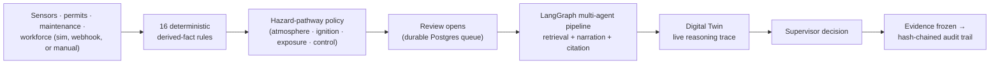

# SOP Opera

**Agentic industrial-safety intelligence** — fuses live sensor, permit, maintenance, and workforce data into a compound-risk picture, drives it to a recorded human decision, and freezes the evidence into an auditable report.

> Single sensors stay silent until gas hits critical. SOP Opera fuses sub-critical gas + hot work without verified isolation + a worker in the zone into a hazard *pathway* — blocks 28 minutes earlier, cites the statute that requires stopping, and leaves a tamper-evident audit trail.

Built for the ET AI Hackathon brief in [`docs/archive/problem statement.md`](docs/archive/problem%20statement.md): in incidents like the January 2025 Visakhapatnam Steel Plant coke-oven explosion, the sensor data existed but no intelligence layer connected it to an operational decision in time. SOP Opera is that layer.

## Why it's different

Large plants already run SCADA, permit-to-work, maintenance, and incident systems — each one sees its own slice. A supervisor authorizing dangerous work has to synthesize all of it, live, from memory. SOP Opera does that synthesis: **16 deterministic rules** turn raw plant context into named facts, a **hazard-pathway policy** (not a fact count) decides whether the combination is genuinely dangerous, a **multi-agent LangGraph pipeline** retrieves matching regulation and incident history and explains what it means, and the human makes the binding call.

The AI never decides. It assesses and recommends; a supervisor's decision — `approved` / `approved_with_conditions` / `blocked` — is the only binding act, and it's the one thing the audit trail can never contradict.

## Results (vs. a conventional single-sensor alarm)

Measured on 593 labeled plant states derived independently from statutory stop-work criteria (Factories Act 1948, OISD-STD-105) — see [`docs/eval-report.md`](docs/eval-report.md) and `/eval` in the running app.

| Detector | Accuracy | Recall | False-negative rate | Precision |
| --- | ---: | ---: | ---: | ---: |
| Single-sensor baseline (conventional SCADA threshold) | 70.5% | 55.5% | 44.5% | 100.0% |
| Predictive forecast (OLS trend) | 66.3% | 68.2% | 31.8% | 78.1% |
| **SOP Opera compound engine** | **98.0%** | **100.0%** | **0.0%** | 97.0% |

Of 393 plant states where a regulation requires stopping work, a conventional threshold alarm misses 175. SOP Opera misses zero, and blocks the hero VSP scenario **28 minutes before** the single-sensor alarm would fire — while gas is still below the critical threshold and before a worker is exposed. Regulatory coverage: 100% of fact-bearing cases cite a regulation, 91.7% cite an Indian statutory provision by clause.

These are criterion-coverage numbers, not a generalization claim — full context on what that means and doesn't in [`docs/comprehensive-guide.md`](docs/comprehensive-guide.md#10-evaluation-results-verified-fresh--regenerated-2026-07-22-matches-shipped-docseval-reportmd-exactly).

## How a plant event becomes a decision



A real SCADA/PTW/historian integration plugs in at the exact seam the demo simulator uses — `POST /api/ingest/webhook`. Nothing downstream cares which adapter produced the reading.

## What it is not

Not a SCADA replacement, an ERP, a general safety chatbot, an auto-approval system, or anything that controls plant equipment — considered and deliberately rejected in favor of a focused product. No plant-wide traffic-light dashboard, no CCTV surveillance, no live 3D twin. The full list of rejected scope, and why, is in the comprehensive guide.

## Architecture

- **Backend** — FastAPI + SQLAlchemy async (raw SQL, no ORM). Domain packages: `reviews`, `context`, `assessment`, `agents`, `risk`, `decisions`, `tasks`, `reports`, `notifications`, `audit`, `graph`, `handover`, `incidents`, `simulator`, `eval`, `ai_ops`, `config`, `auth`, `realtime`. No migration system — `db/schema.sql` is idempotent and applied on every boot.
- **AI pipeline** — LangGraph `StateGraph` that fans out *selectively*: source agents (scada/permit/maintenance/workforce) only run when their facts are present; spatial runs on elevated/gas/hot-work signals; predictive-trend when the focus asset has telemetry; shift-handover when this asset carried unacknowledged items; incident-pattern retrieval only once a verdict is elevated or blocking. A nominal review is orchestrator-only. Retrieval is orchestrator-driven — deterministic SQL guarantees a citation for every regulation/SOP reference; vector search is used only for incident precedent.
- **Frontend** — Next.js 15 App Router + React 19 + Zustand. `/operator` is the live Digital Twin (2D plant map, agent reasoning trace, domain radar, predictive trend); review cases deep-link as `/operator?review={id}`. `/supervisor` is the review/decision queue; `/eval` is the detector scorecard; **Settings** (nav) holds the threshold editor. A scripted **Grand Tour** walks the whole product end-to-end for a 3-minute demo.
- **Data** — Postgres + pgvector, 28 tables, hash-chained `audit_entries` so tampering is detectable (`GET /audit/verify`), durable `SKIP LOCKED` assessment queue so jobs survive worker restarts. Elevated/hold closures promote into the historical-incident corpus for later retrieval.

Full architectural detail, API surface, and the reasoning behind each design choice: [`docs/comprehensive-guide.md`](docs/comprehensive-guide.md).

## Project layout

```
backend/             FastAPI app (routes → service → repository per domain)
frontend/            Next.js app (App Router, Zustand store, CSS Modules)
shared/              TS + Python contracts and fixtures — source of truth
frontend/shared/     Generated copy of shared/ (never edit directly)
docs/                Current reference docs (see below)
docs/archive/        Superseded/historical docs
scripts/             Run scripts, dev API entrypoint, shared-contract sync
docker-compose.yml   Postgres + pgvector only (optional helper)
```

## Running it

**Prerequisites:** Python 3.11+, Node.js 20+, Postgres + pgvector on `localhost:5433` (`docker compose up -d db` starts just the DB).

```bash
./scripts/run-linux.sh          # or run-mac.sh / run-windows.ps1
```

This creates `.env` from `.env.example` if missing, starts Postgres via Docker if available, installs Python/Node dependencies, and runs the API (`:8000`) and the Next.js app (`:3000`). Open **http://localhost:3000**.

Run pieces individually:

```bash
docker compose up -d db          # DB only
python scripts/dev-api.py        # backend, :8000, --reload
cd frontend && npm run dev       # frontend, :3000
```

After editing root `shared/`, run `node scripts/sync-shared.mjs` (also runs automatically on `npm run dev` / `build`).

## Tests

```bash
# Backend — from backend/, with the repo root on PYTHONPATH
cd backend && source ../.venv/bin/activate && export PYTHONPATH=/path/to/sop-opera
python -m pytest -q                                    # whole suite
python -m pytest -q tests/test_state_machine.py        # single file

# Frontend
cd frontend && npx tsx --test lib/*.test.ts
```

Pure-logic backend tests (`test_state_machine.py`, `test_agent_routing.py`, `test_agents_langgraph.py`, `test_ambient.py`, `test_config_thresholds.py`, `test_scenario_dsl.py`) need no database and finish in under a second. The rest spin a real Postgres-backed app instance — run them a file at a time.

## Docs

| Doc | What it's for |
| --- | --- |
| [`docs/comprehensive-guide.md`](docs/comprehensive-guide.md) | The current, verified project reference — start here for anything beyond this README |
| [`docs/eval-report.md`](docs/eval-report.md) | Regenerable detector metrics (accuracy, false-negative rate, lead time) |
| [`docs/audit-2026-07.md`](docs/audit-2026-07.md) | How the eval numbers were verified to be non-circular and trustworthy |
| [`docs/architecture-ingest.md`](docs/architecture-ingest.md) | Ingest and assessment-queue scaling design |
| [`docs/business-impact-model.md`](docs/business-impact-model.md) | Sourced ₹ cost/ROI model |
| [`docs/pitch-scorecard.md`](docs/pitch-scorecard.md) | One-pager for pitching — headline numbers and demo beats (Eval = scorecard; Settings = thresholds) |
| [`docs/todo.md`](docs/todo.md) | Live working list |
| [`docs/archive/`](docs/archive/) | Superseded design docs and historical notes — not current, kept for record |

`CLAUDE.md` at the repo root has the full architectural map for anyone (human or AI) working in this codebase.
