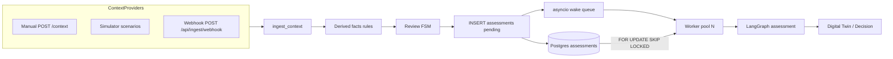

# Ingest & assessment architecture

How plant context reaches the Digital Twin and how assessments scale under load.



## ContextProvider seam

Every source implements the same `emit(ContextIn) → ContextIngestResult` contract:

| Provider | Entry point | `provider` tag |
| --- | --- | --- |
| Manual | `POST /context` | `manual` (or caller) |
| Simulator | demo scenario engine | `simulator` |
| Webhook | `POST /api/ingest/webhook` | `source_system` (e.g. `scada-historian`) |

Real SCADA/PTW historians plug in by POSTing the webhook envelope — same facts, reviews, and twin path as the hackathon simulator.

### Curl demo

```bash
curl -s -X POST http://localhost:8000/api/ingest/webhook \
  -H 'Content-Type: application/json' \
  -d '{
    "source_system": "scada-historian",
    "asset_name": "Vessel A",
    "readings": [{"metric": "gas_reading", "value": 28.0, "unit": "ppm"}]
  }'
```

Watch the twin for elevated gas on Vessel A, then:

```bash
curl -s http://localhost:8000/api/assessment-jobs/queue | jq
```

## Assessment job queue

- Rows in `assessments` with `status=pending` are the durable queue (no Redis).
- `assessment_worker_count` (default **2**) in-process workers drain jobs.
- Fast path: memory `asyncio.Queue` wake after enqueue.
- Durable path: workers poll and `UPDATE … FOR UPDATE SKIP LOCKED` so concurrent workers never double-run.
- On API restart, `generating` rows reset to `pending` and are recovered.

Config: `ASSESSMENT_WORKER_COUNT=2` in `.env`.
