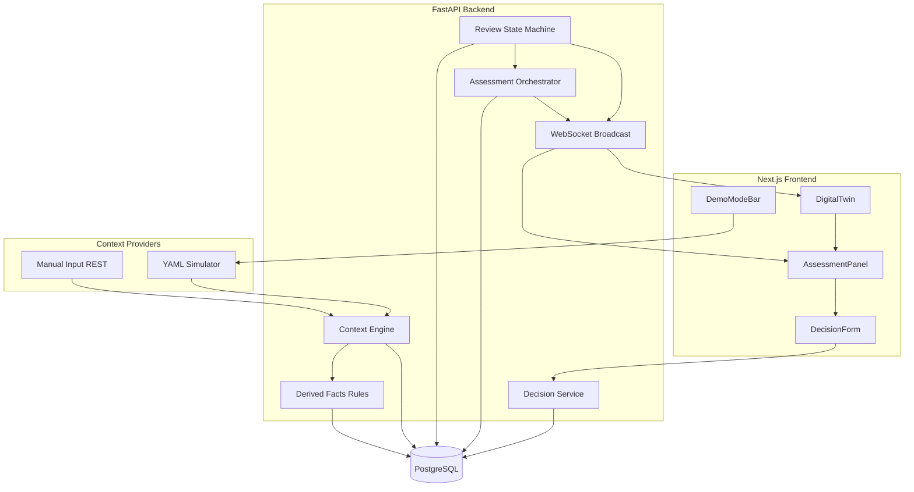

# SOP Opera — Implementation Guide
### The full picture: what we're building, how it works, and what it looks like when done

**Audience:** You and the team — for deep understanding before and during the build.  
**Companion to:** [Project Overview](./project-overview.md) (start there if you're new).  
**Build from:** [Technical Design Spec](./Technical%20Design%20Spec.md) (source of truth for code).  
**Demo from:** [Execution Decisions](./execution-decisions.md) (pitch and choreography).

This document bridges the gap between "what is this?" and "how do I implement it?" — architecture, features, frozen decisions, and a concrete picture of the finished product, in plain language.

---

## 1. The idea in 60 seconds

Industrial supervisors already decide whether dangerous work can proceed. The information often exists — in SCADA, permits, maintenance systems — but nobody synthesizes it at decision time. **SOP Opera** runs a structured **Operational Review**: rules surface the facts, AI explains what they mean together, the supervisor makes the call, and the system leaves a permanent audit record.

We are **not** replacing plant systems. We are making an existing decision visible, explainable, and defensible.

---

## 2. Who it's for and how we talk about it

| Role | Relationship |
| --- | --- |
| **Shift Supervisor** (protagonist) | Runs the review, reads the assessment, records the decision |
| **HSE / Safety Officer** (secondary) | Reads reports, trends, escalations — after the operational call |

**Positioning (frozen):** This is not "another app to open." The decision already happens via paper, phone, WhatsApp, and SCADA. SOP Opera structures and audits it.

**Customer:** Plant Operations / EHS.  
**Workflow change:** Every critical permit gets a short Operational Review before approval.  
**Value:** Fewer near-misses, better decisions, explainable audit trail, faster incident reconstruction.

---

## 3. What the final product looks like

When you're done building, a supervisor opens a **web app** that lands directly on a **2D plant floor map** with a **Demo Mode** bar at the top.

### The main screen (what judges see first)

```
┌─────────────────────────────────────────────────────────────────┐
│  Demo Mode:  [Compound Risk ▼]  [Start]  [Reset]               │
├─────────────────────────────────────────────────────────────────┤
│                                                                 │
│     ┌──────────┐         ┌──────────┐                          │
│     │ Vessel A │ ◄────── │ Walkway  │   ← SVG floor plan       │
│     │ (BLOCKING│         │          │     Assets highlight     │
│     │  highlight)        └──────────┘     live as risk grows  │
│     └──────────┘                                                │
│                                                                 │
├─────────────────────────────────────────────────────────────────┤
│  Side panel (opens when you click an asset)                     │
│                                                                 │
│  Reasoning trace:                                               │
│    Asset → Context → Derived Facts → References → Assessment    │
│    → Recommendations → Decision                                 │
│                                                                 │
│  [ Assessment panel: summary, risk level, recommendations ]     │
│  [ Decision: Approved | Approved with Conditions | Blocked ]    │
└─────────────────────────────────────────────────────────────────┘
```

### A full session (hero workflow)

1. Supervisor (or demo operator) hits **Start Compound Risk**.
2. Over ~25 seconds, scripted plant events arrive: gas rises → worker enters zone → permit activates.
3. The map **updates live** (WebSocket): asset goes from all-clear → elevated → blocking.
4. Supervisor **clicks the highlighted asset**. The reasoning trace shows exactly which context and facts drove the assessment.
5. Assessment panel shows AI summary, risk level `blocking`, and recommendations.
6. Supervisor records **Blocked** (or Approved with Conditions).
7. **Evidence freezes** — snapshot of what was known at decision time.
8. **Report generates** — audit-ready record for investigators or HSE.

That is the product. Everything else (review list, notifications, AI ops) exists but is not the main story.

### What it feels like vs. what it is

| Feels like | Actually is |
| --- | --- |
| "A live plant map reacting to danger" | Real UI driven by real backend state |
| "The plant is sending data" | Deterministic YAML simulator (or manual POST) feeding the same pipeline a SCADA feed would |
| "AI caught the gas leak" | Rules detected elevated gas; AI synthesized facts + regulations + history into language and recommendations |

---

## 4. Real product vs. demo stand-ins

**You are building real software.** The hackathon simplifies *inputs*, not *logic*.

### Real (fully implemented)

- PostgreSQL persistence for reviews, context, facts, assessments, decisions, evidence, audit
- Review state machine with legal transitions only
- Context engine + six deterministic derived-fact rules (three canonical + isolation / SIMOPS / certification)
- Assessment orchestrator: hybrid retrieval (RAG → quality gate → deterministic fallback), LLM call, schema validation, retry, failure handling
- Manual Assessment fallback when AI fails
- Decision endpoint with evidence freeze
- Report generation on closure
- WebSocket live updates to the frontend
- Digital Twin driven by assessment + derived-fact state (not fake animations in the final build)
- Seeded `knowledge_chunks` corpus with pgvector embeddings for semantic retrieval

### Stand-ins (hackathon scope)

- **Plant events:** YAML simulator + manual REST input — not live SAP/SCADA/PTW
- **Plant data:** One seeded plant, static SVG + JSON asset map
- **Users:** Seeded demo users, no login/SSO
- **Master data:** Fixtures in DB, no admin CRUD UI
- **Audit:** Insert-only by convention, not cryptographically tamper-proof
- **RAG corpus:** Seeded regulation / incident / SOP chunks — not a live document platform

The **Context Provider interface** is the integration seam. Simulator and Manual Input use it today; SCADA/SAP would implement the same interface later.

---

## 5. Frozen decisions (do not reopen)

These were debated and settled. Implementation follows the TDS.

### Product & ownership

- **Three objects, three owners:** Review (platform) · Assessment (AI or manual author) · Decision (human supervisor)
- **AI never decides.** Human never edits an assessment — they respond with a decision.
- **Every decision** must reference a Complete Assessment (AI or Manual).

### State machine (canonical)

```
Opened → Assessing → Pending Decision → Decided → Closed
```

Secondary: `Escalated`, `Reopened`. No `Execution` or `Completed` — physical work is outside the platform.

### Decision outcomes

| Display label | Stored value | Meaning |
| --- | --- | --- |
| Approved | `approved` | Proceed as assessed |
| Approved with Conditions | `approved_with_conditions` | Proceed after stated mitigations (`conditions` required) |
| Blocked | `blocked` | Do not proceed under current conditions |

No Rejected/Deferred — use Blocked and Approved with Conditions.

### AI architecture

- **Rules produce facts.** LLM does not detect gas, permits, zones, isolation, SIMOPS, or certification gaps.
- **Hybrid retrieval under Orchestrator control:** RAG (pgvector) first → quality gate → deterministic SQL fallback. LLM never picks tools.
- **LLM synthesizes:** facts + retrieved regulations / SOPs / incidents → reasoning + recommendations.
- **No agent loops.** Orchestrator decides retrieval and builds the query; LLM only reasons over given information.
- **Structured output mandatory.** Pydantic validation, one retry, then visible failure.
- **Providers:** Mock (dev) · OpenAI-compatible (primary) · Ollama (fallback). Embeddings: OpenAI-compatible primary · local fallback · mock for CI.

### Terminology

| Term | Meaning |
| --- | --- |
| **Context** | Live operational information from any provider |
| **Derived Fact** | Deterministic rule output (e.g. Elevated Gas) |
| **Evidence** | Frozen Context + Assessment cited at Decision time |
| **Retrieved references** | Regulations, incidents, SOPs pulled via hybrid retrieval for the AI prompt — not Evidence until decision |

### Assessment types

| Type | Author | When |
| --- | --- | --- |
| **AI Assessment** | Orchestrator + LLM | Normal path |
| **Manual Assessment** | Supervisor via API | AI failed after retry; human still needs to decide |

### Demo & UX (frozen)

- App opens on **Digital Twin in Demo Mode**, not review list
- Primary demo surfaces: Twin · Assessment · Decision
- Story closes: Decision → Evidence → Report → audit record
- Simulator is **scripted YAML**, not random plant noise

---

## 6. Architecture — the simple version

One backend process, one database, one frontend app. No microservices, no Kubernetes, no message broker.



### The four subsystems (who owns what)

| Subsystem | Owns | Does not own |
| --- | --- | --- |
| **Operational Review** | Lifecycle, state transitions, participants | AI content, twin rendering |
| **Assessment Pipeline** | Orchestration, providers, retrieval, validation | Decisions, review state |
| **Digital Twin** | Map, highlights, reasoning trace UI | Simulation, assessments |
| **Simulator** | Scripted context events | AI, review logic |

### Engineering rules enforced in code

1. Only `transition_review()` writes `reviews.state`.
2. Only the AI pipeline writes AI assessments; only the manual endpoint writes manual assessments.
3. Only the Decision endpoint writes decisions.
4. No LLM call sees raw context — only derived facts + context references + retrieved references.
5. Orchestrator owns retrieval: RAG primary, deterministic SQL as guaranteed fallback.
6. WebSocket broadcasts to all clients; frontend filters by relevance.

---

## 7. How data flows (end to end)

This is the spine. Every feature serves this loop.

```
1. Context arrives          (simulator POST or manual POST)
        ↓
2. Persisted + rules run    (six derived-fact rules; Compound Risk uses the canonical three)
        ↓
3. Review → Assessing       (state machine)
        ↓
4. Orchestrator picks job   (hybrid retrieval → LLM → validate)
        ↓
5. Assessment complete      (WebSocket: assessment.completed)
        ↓
6. Review → Pending Decision
        ↓
7. Twin + panel update      (highlights from facts + assessment)
        ↓
8. Supervisor decides       (approved / approved_with_conditions / blocked)
        ↓
9. Evidence frozen          (immutable snapshot)
        ↓
10. Review → Closed         → Report generated → Audit entries throughout
```

**Reassessment:** If material new context arrives while Pending Decision, review returns to Assessing, old assessment is superseded (not deleted), new one is generated.

**AI failure:** Assessment stays failed visibly. Supervisor can retry, switch provider, or submit Manual Assessment — then proceed to decision.

---

## 8. Every feature explained

### Core (demo-critical)

| Feature | What it does | User-visible? |
| --- | --- | --- |
| **Digital Twin** | 2D SVG map; assets highlight by risk; click opens reasoning trace | Yes — hero |
| **Demo Mode** | Start/reset scripted scenarios (gas leak, permit conflict, compound risk) | Yes — hero |
| **Context Engine** | Ingests and stores canonical context from any provider | Behind the scenes |
| **Derived Facts** | Six Python rules turn context into named facts | Shown in trace |
| **Assessment Pipeline** | Orchestrator + hybrid retrieval + LLM + validation | Yes — assessment panel |
| **Manual Assessment** | Supervisor-authored fallback when AI fails | Yes — recovery flow |
| **Decision** | Human binding call with per-recommendation accept/reject | Yes — hero |
| **Evidence freeze** | Snapshot at decision time | Yes — story close |
| **WebSockets** | Live twin and UI updates | Yes — feels alive |

### Supporting (built, not demo-first)

| Feature | What it does | User-visible? |
| --- | --- | --- |
| **Review list / detail** | Browse reviews by state | Secondary nav |
| **Reports** | Generated narrative per closure | Story close + HSE |
| **Notifications** | In-app alerts on domain events | Panel, optional |
| **AI Ops dashboard** | Success rate, failures, RAG hit/fallback rate, relevance | Backup / technical judges |
| **Audit entries** | Append-only log of every transition | Report / investigator view |
| **Escalation / Reopen** | Secondary state paths | Built, demo optional |

---

## 9. The simulator (not random)

The simulator is a **scripted replay engine**, not a random plant generator.

Each scenario is a YAML file with timed steps:

```yaml
steps:
  - delay_seconds: 0
    type: sensor_update
    payload: { gas_reading: 25.5, asset_id: vessel-a }
  - delay_seconds: 15
    type: worker_movement
    payload: { worker_id: w-1, zone: hazardous }
```

Same script, same timing, every run. Three scenarios:

| Scenario | Story |
| --- | --- |
| **Gas Leak** | Single signal — gas crosses threshold |
| **Permit Conflict** | Two overlapping permits on one asset |
| **Compound Risk** | Gas + worker in zone + permit — signature demo |

Each step becomes a real Context record through the same path manual input uses.

---

## 10. The AI pipeline (step by step)

1. **Orchestrator** picks up `assessments` row with `status = pending`.
2. Reads active **derived facts** for the review's asset.
3. **Hybrid retrieval** (Orchestrator builds the query; LLM does not):

   **a. RAG primary** — embed query → pgvector cosine top-k over `knowledge_chunks` (hard timeout ~3s).

   **b. Quality gate** — grade `good` / `weak` / `empty` (score threshold + min chunk count).

   **c. Deterministic fallback** — if not `good`, SQL lookup via `RETRIEVAL_RULES`:

   | Fact type | Fetches (fallback map) |
   | --- | --- |
   | `elevated_gas` | Regulations |
   | `permit_conflict` | SOPs + regulations |
   | `zone_occupied` | Historical incidents |
   | `incomplete_isolation` | SOPs + regulations |
   | `simultaneous_ops` | SOPs + historical incidents |
   | `certification_expiring` | Regulations + SOPs |

4. Builds prompt: derived facts + context IDs + retrieved text (each ref tagged with path + score).
5. Calls active **provider** (OpenAI-compatible primary, Ollama fallback, Mock for dev).
6. **Validates** response against Pydantic schema.
7. On failure: **one retry** with repair instruction.
8. On second failure: `status = failed`, review stays in Assessing, UI shows recovery path.
9. On success: persist assessment + recommendations + metadata (tokens, latency, model, confidence, `retrieval_mode`, `retrieval_quality`, `retrieval_score`, embedding model).

The LLM never chooses tools, never changes review state, never writes decisions. Deterministic retrieval is never removed — it is the guaranteed floor if RAG is weak or cut under time pressure.

---

## 11. The Digital Twin (signature moment)

- Static SVG floor plan + `floor_plan_map.json` (asset ID → SVG element + coordinates).
- Highlight states derived from **latest assessment risk level** + **active derived facts**:
  - `nominal` — all-clear
  - `elevated` — caution
  - `blocking` — do not proceed
- Click asset → **reasoning trace panel** (top to bottom):

  ```
  Asset → Context → Derived Facts → Retrieved References
       → Assessment → Recommendations → Decision
  ```

  The **Retrieved References** node shows path (`rag` / `deterministic`) and relevance score when available — so "show me retrieval" is answered on-screen, not on slides.

Before decision: shows live context. After decision: cited snapshot is evidence.

This is the one thing people should remember.

---

## 12. Tech stack and repo shape

| Layer | Choice |
| --- | --- |
| Frontend | Next.js (App Router), TypeScript, React, TanStack Query, Zustand |
| Backend | FastAPI, SQLAlchemy 2 async, asyncpg |
| Database | PostgreSQL + **pgvector** extension, single `schema.sql` |
| Embeddings | OpenAI-compatible primary · local fallback · mock for CI |
| Realtime | WebSocket broadcast (browser client → FastAPI; not Next API routes) |
| Shared contracts | `shared/` package (types both sides agree on) |
| Config | `.env` via Pydantic Settings (incl. RAG thresholds / timeout) |

```
shared/           ← contracts frozen in Phase 0
backend/app/      ← reviews, context, assessment/retrieval, decisions, simulator, …
frontend/         ← Next.js app/ + features/digital-twin, assessment, demo, …
```

**UI rule:** FastAPI owns all business APIs and WebSockets. Next.js is the shell for routing, deploy, and Client Components — do not reimplement Assessment/Decision in Next route handlers.
---

## 13. Database (what gets stored)

Think in layers:

**Master data (seeded):** assets, workers, departments, permits, review types, regulations, sops, incidents, users.

**Knowledge corpus (seeded + pre-embedded):** `knowledge_chunks` — chunked regulations / incidents / SOPs with pgvector embeddings for RAG.

**Transactional (the product):** reviews, context_entries, derived_facts, assessments, recommendations, decisions, evidence.

**Downstream (react to events):** reports, notifications, audit_entries, assessment_metadata (includes retrieval_mode / quality / score).

Evidence and audit are **immutable** once written. Assessments are **superseded**, never edited.

---

## 14. API surface (what the frontend calls)

| Area | Key endpoints |
| --- | --- |
| Reviews | `POST /reviews`, `GET /reviews/{id}`, escalate, reopen |
| Context | `POST /context`, `GET /assets/{id}/context` |
| Assessments | list, `retry`, `manual` |
| Decisions | `POST /reviews/{id}/decisions` |
| Demo | `POST /demo/scenarios/{name}/start`, `reset`, list scenarios |
| Reports / Notifications / AI Ops | read-only supporting endpoints |

WebSocket events include `review.status_changed`, `assessment.completed`, `assessment.failed`.

---

## 15. Build phases (how we get there)

Work is divided by **phase**, not rigid day ownership. Early phases use fake data so you can see the product before the backend exists; later phases swap in the real spine.

| Phase | Outcome | Pivot point? |
| --- | --- | --- |
| **0 — Foundation** | Shared contracts (incl. RetrievedReference), schema + pgvector/`knowledge_chunks`, skeleton apps, fixtures | |
| **1 — Clickable skeleton** | Full UI on fake data; twin + trace + decision screens | **Yes — eyeball the product** |
| **2 — Backend spine** | State machine, context, six derived-fact rules, audit, WebSocket | |
| **3 — Assessment pipeline** | Hybrid retrieval (RAG + gate + fallback), Mock + real AI, manual assessment, observability | |
| **4 — Live loop** | Real WS + real assessment + decision + evidence freeze | **Yes — "real product" bar** |
| **5 — Simulator** | Three YAML scenarios driving real backend | |
| **6 — Story close** | Reports, notifications, AI ops (incl. RAG metrics), audit view | |
| **7 — Polish** | QA, RAG threshold tuning, rehearsal, demo recording | |

**"Real product" checkpoint:** Compound Risk runs with no frontend fixtures — simulator → rules → hybrid retrieval → LLM → twin updates → decision → evidence in Postgres.

**Protect under pressure:** Compound Risk end-to-end → twin reasoning trace → decision + evidence + report. Cut AI Ops and notifications before cutting those. Deterministic retrieval is the floor — cut RAG last (or disable via `RAG_ENABLED`), never delete the fallback.

---

## 16. What we are not building

- SCADA / ERP / PTW replacement
- Plant-wide risk dashboard or traffic-light score
- Auto-approval
- Safety chatbot
- CCTV surveillance
- Live 3D twin or geospatial heatmap
- Real enterprise adapters in the hackathon build

---

## 17. How the docs fit together

| Read order | Document | Purpose |
| --- | --- | --- |
| 1 | [Project Overview](./project-overview.md) | Quick understanding |
| 2 | **This doc** | Full picture — product, architecture, features, decisions |
| 3 | [Technical Design Spec](./Technical%20Design%20Spec.md) | Exact build spec when coding |
| 4 | [Execution Decisions](./execution-decisions.md) | Demo script and pitch |
| — | [archive/](./archive/) | Earlier design drafts — reference only |

---

## 18. Quick reference card

```
Problem:     synthesis missing at authorization time
User:        Shift Supervisor
Product:     Operational Review → Assessment → Decision
Memorable:   Digital Twin reasoning trace
Rules:       six facts (beyond PS's three examples)
Retrieval:   RAG primary → quality gate → deterministic fallback
AI:          synthesize + explain + recommend
Human:       decides (always)
Simulator:   scripted YAML, not random
Real:        state machine, DB, pipeline, evidence, WS, pgvector
Fake:        plant feeds (simulator stands in for SCADA)
Demo open:   Twin + Demo Mode
Demo close:  Evidence → Report → audit record
```

---

*Architecture is frozen for coding. The pre-build amendment (six facts + hybrid retrieval) is intentional — see TDS closing note. Build from the TDS. Present from Execution Decisions. Use this doc when you need the whole picture in one sitting.*
