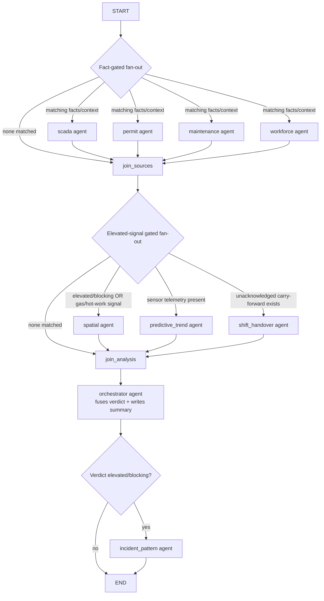

# SOP Opera — Comprehensive Project Guide

*Team reference and pitch-deck source material. Verified against the codebase on 2026-07-22 (not just against older design docs, several of which have drifted — see "Where the older docs are stale" at the end).*

---

## 1. The problem, in one paragraph

Large industrial plants already run plenty of software — SCADA for sensors, SAP/Maximo for maintenance, permit-to-work (PTW) systems, incident databases. Each system knows its own slice of the plant. None of them reliably tells a supervisor **everything relevant at once** at the moment they must authorize dangerous work. In January 2025, eight workers died when entrapped gases exploded in the coke-oven battery at Visakhapatnam Steel Plant (VSP) — a facility with functioning gas detectors, permit-to-work controls, and SCADA. An investigation found the warning signals existed in the plant's own systems; nothing connected them to the decision in time. DGFASLI recorded 6,500+ fatal workplace accidents in India in FY2023 (excluding most of mining/construction), and a 2024 FICCI survey found over 60% of large industrial facilities still rely on manual handoffs between their own digital safety tools.

**The problem is not missing data. It is missing synthesis at the exact moment a human must decide.**

This is the hackathon brief in `docs/archive/problem statement.md`. Judging weights: **Business Impact 25% · Technical Excellence 25% · Scalability 20% · UX 15% · Innovation 15%.**

---

## 2. What SOP Opera is, in one sentence

> An agentic industrial-safety-intelligence layer — a LangGraph multi-agent system over live plant context (sensors, permits, maintenance, workforce) that detects compound risk, cites regulation and precedent, and drives a structured, auditable **Operational Review** to a human decision.

We are **not** inventing a new decision — supervisors already make this go/no-go call every shift, via paper, radio, and memory. We make that decision **structured, explainable, and auditable**, with a live multi-agent reasoning trace the supervisor can click into.

What it is **not**: a SCADA replacement, an ERP, a general chatbot, an auto-approval system, or anything that controls plant equipment. The AI never decides; the human decision is the only binding act.

---

## 3. Who it's for

| Actor (as modeled in auth) | Product role | Home screen | What they do |
| --- | --- | --- | --- |
| `user` | **Operator / control-room** — the protagonist of the demo | `/operator` → Digital Twin | Watches live plant state, opens the reasoning trace, reads assessments |
| `worker` | **Shift supervisor / area in-charge** — the accountable decision-maker | `/supervisor` | Reviews tasks, floor reports, "raised by me / shared with me / in my zones" review queues, records decisions |

Secondary user: HSE/Safety Officer — cares about trends, audit trail, and closed cases, not the live demo protagonist. Not building for: data scientists, plant-wide monitoring operators, or executives wanting a traffic-light dashboard.

---

## 4. The three objects that structure everything

| Object | Owner | What it is |
| --- | --- | --- |
| **Review** | The platform | The case file — one high-risk activity, tracked open → assessing → pending decision → closed |
| **Assessment** | The AI (or a supervisor, manually, as fallback) | The structured analysis: what was found, why it matters, what's recommended |
| **Decision** | The human supervisor | The binding call — `approved` / `approved_with_conditions` / `blocked` |

There is no "execution/completion" state in the platform — physical work happens outside it, though a decision does spawn follow-through `review_tasks`.

---

## 5. The spine — how a plant event becomes a decision

```mermaid
flowchart LR
  subgraph adapters [Context arrives]
    Manual["Manual POST /context"]
    Sim["Simulator scenarios"]
    Webhook["Webhook POST /api/ingest/webhook"]
  end

  adapters --> Ingest["ingest_context"]
  Ingest --> Facts["Derived-fact rules\n(16 pure Python rules)"]
  Facts --> Policy["Hazard-pathway policy\n(app/risk/policy.py)"]
  Policy --> Review["Review FSM"]
  Review --> Enqueue["assessments: pending\n(durable Postgres queue)"]
  Enqueue --> Workers["Worker pool (N)\nFOR UPDATE SKIP LOCKED"]
  Workers --> Agents["LangGraph multi-agent graph"]
  Agents --> Validate["Citation validation"]
  Validate --> Persist["Assessment persisted"]
  Persist --> Twin["Digital Twin / Assessment panel\n(ws: assessment.completed)"]
  Twin --> Decision["Supervisor decision"]
  Decision --> Evidence["Evidence frozen"]
  Evidence --> Close["Review closed → report generated"]
```



Audit entries are written at every step along this spine (`audit_entries`, hash-chained — see §12).

A real SCADA/PTW/historian system plugs in at the exact same seam a hackathon simulator uses: `POST /api/ingest/webhook`. Nothing downstream cares which adapter produced the reading.

---

## 6. The derived-facts engine — deterministic, not AI

**This is the most important design decision to say out loud to judges**: hazard *detection* is pure, deterministic Python — never the LLM. This is what makes the eval harness legitimately scoreable, and it's the reason a false-negative-rate claim means something.

`backend/app/context/derived_facts.py` currently ships **16 rules** (grown well past the "textbook three" from the problem statement, and past the "six" cited in some older docs):

| Fact | Fires when | Hazard dimension(s) it supplies |
| --- | --- | --- |
| `elevated_gas` | Gas reading ≥ elevated (early-warning) threshold | Atmosphere |
| `critical_gas` | Gas reading ≥ critical/incident threshold — **the single-sensor baseline** | Atmosphere |
| `over_temperature` | Temperature ≥ elevated threshold | Ignition/energy |
| `critical_temperature` | Temperature ≥ critical threshold — **the other single-sensor baseline** | Ignition/energy |
| `equipment_vibration_anomaly` | Vibration reading above threshold | Ignition/energy |
| `effluent_quality_breach` | pH outside safe band | Atmosphere |
| `tank_level_critical` | Tank level outside high/low band | Atmosphere |
| `permit_conflict` | ≥2 active permits on the same asset | Control failure |
| `incomplete_isolation` | Active hot-work/confined-space permit with isolation not confirmed | Ignition/energy + Control failure |
| `simultaneous_ops` | Incompatible concurrent work types (hot work + confined space) | Control failure |
| `certification_expiring` | An on-site worker's certification expires within the warning window | Control failure |
| `weather_hold` | High wind or lightning while hot work/lifting is exposed | Control failure |
| `zone_occupied` | A worker's *reported* location is hazard-classified (not a geometry check — see rule docstring) | Exposure |
| `ppe_noncompliance` | Reported PPE non-compliance | Exposure |
| `lifting_operation_conflict` | ≥2 active lift plans overlapping | Exposure + Control failure |
| `supervisor_floor_report` | A supervisor files a concern directly from the floor | (routes to the concern's own fact type) |

Rules are pure functions over `ContextEntryView` — they see only the context entry, never asset metadata or the knowledge graph. That purity is deliberate (see §14), and it's why `zone_occupied` reads a *reported hazard classification* rather than computing distance from `assets.zone` — the two fields share a name but mean different things, and that trap is called out directly in the code's docstring.

---

## 7. The verdict — a hazard *pathway*, not a fact count

`backend/app/risk/policy.py` (`classify()`) is **the single source of truth** for turning facts into a verdict — the agent orchestrator, `reviews/service.py`, and the eval harness all call into it, so the verdict that ships and the verdict that gets measured cannot drift apart. Version tag in code: `hazard-pathway-2`.

The earlier design was "3+ facts → block." That treats a weather hold + expiring certification + a PPE gap as equivalent to a gas release next to unverified hot work — it counts what we know, not how dangerous the state is. Instead, every fact supplies one or more of four **hazard dimensions**, borrowed from classic fire-triangle/process-safety reasoning:

- **Atmosphere** — a hazardous substance is present or escaping containment
- **Ignition/energy** — an energy source capable of initiating or escalating the hazard
- **Exposure** — people are in, or entitled to enter, the affected space
- **Control failure** — a barrier meant to keep the above apart is missing, unverified, or conflicting

A verdict **blocks** when any of these (checked most-specific-first) match:

1. A single-sensor critical fact fires (`critical_gas` / `critical_temperature`) — the traditional SCADA alarm line
2. A supervisor reports a safety hazard directly from the floor
3. **Full pathway**: atmosphere + ignition/energy + control failure co-occur — the compound-risk thesis, a complete initiation pathway
4. Atmosphere + exposure co-occur (inhalation/asphyxiation route — no ignition source needed)
5. `simultaneous_ops` fires on its own — incompatible operations defeat each other's controls regardless of atmosphere
6. ≥3 complementary dimensions co-occur *with* exposure
7. Spatial proximity completes a pathway across assets (atmosphere + exposure/control nearby)

Anything grounded but short of a pathway is **elevated**, not blocking. **Grounding is enforced in code**: a blocking verdict must rest on at least one deterministic rule fact — `predicted_trend_risk` (an OLS forecast) and `spatial_cooccurrence` (a proximity marker) can escalate a verdict to *elevated*, or strengthen a block that's already grounded, but neither can ground a block by itself. If somehow only ungrounded signals would produce "blocking," the code downgrades it to elevated automatically.

A related signal, `unacknowledged_handover` (a hazard on this asset carried across a shift boundary that the incoming operator never acknowledged), escalates nominal → elevated but is likewise never allowed to manufacture a hazard dimension on its own — it's a fact about paperwork, not the plant.

---

## 8. The multi-agent AI pipeline (LangGraph)

Once a review needs assessing, `backend/app/agents/graph.py` runs a `StateGraph` that **fans out selectively** — a nominal review with no elevated signal is orchestrator-only; nothing else spins up. Routing/gating logic lives in `backend/app/agents/routing.py`.



**What each node does:**

- **Source agents** (`scada`, `permit`, `maintenance`, `workforce`) — each interprets its own silo of context and emits a local risk read plus a short narration (LLM-narrated in 1–2 sentences when facts are active; deterministic template otherwise, e.g. under `AI_PROVIDER=mock` or on failure).
- **Spatial agent** — queries the plant knowledge graph (`graph/kg.py`, real `networkx`, 53 nodes, Euclidean-derived `NEAR`/`ABOVE`/`BELOW` edges) for hot-work within radius of a gas spike, including vertical (floor) adjacency. Runs only when a domain is already elevated, or gas/active hot-work is present.
- **Predictive-trend agent** — an OLS extrapolation over recent telemetry projecting near-term threshold crossings; only a *signal*, per §7. Runs whenever the focus asset has sensor telemetry.
- **Shift-handover agent** — checks whether this asset carried an unacknowledged high-risk item across a shift boundary. Runs pre-verdict (unlike the enrichment agents) because that fact feeds the risk policy directly, not just narration.
- **Orchestrator** — fuses everything into a `risk_level` + summary + recommendations. **The LLM never sets `risk_level`** — the deterministic policy already decided that; the LLM (when configured) only writes the narrative and cites up to 2 retrieved references. Under the default `AI_PROVIDER=mock`, no network call happens at all and the UI says "deterministic narration · no LLM configured."
- **Incident-pattern agent** — runs only when the verdict is elevated/blocking; RAG-echoes prior near-misses with visible retrieval path + score.

**Retrieval** (`backend/app/assessment/retrieval/`) is orchestrator-driven, not model-driven: it tries pgvector semantic search first, applies a quality gate, then falls back to deterministic SQL. Two things worth knowing before calling this "RAG":

- `RAG_VECTOR_SOURCE_TYPES = ["historical_incidents"]` — semantic/vector search is used **only** for incident precedent. Regulations and SOPs are retrieved by deterministic SQL, always, so a citation is guaranteed present.
- With the default `EMBEDDING_PROVIDER=mock` (a hash-derived pseudo-vector), the quality gate never passes, so the deterministic path wins by design in dev/demo. This is a deliberate trade for guaranteed citation coverage, not an accident.

**Citation guardrail**: `assessment/citations.py` checks citation-shaped tokens in the generated summary against what was actually retrieved and strips anything unsupported — a generated summary literally cannot name a source it wasn't given.

---

## 9. The demo scenarios

Five scripted YAML scenarios live in `backend/app/simulator/scenarios/`, replayed by the same `ingest_context` seam a real SCADA feed would use:

| Scenario | What happens |
| --- | --- |
| **`vsp_coke_oven`** (hero scenario) | VSP-pattern compound risk on Vessel A — see timeline below |
| `compound_risk` | Signature build-up: gas rises → worker enters hazardous zone → conflicting permits activate → compound block |
| `gas_leak` | Single-signal case: gas climbs past threshold → `elevated_gas` → review opens, elevated assessment |
| `permit_conflict` | Single-signal case: two overlapping active permits on Compressor B → `permit_conflict` |
| `spatial_proximity` | Cross-asset compound: elevated gas on Vessel A while hot work activates on Walkway 3 within KG radius — spatial agent flags a co-occurrence no single silo would see |

**`vsp_coke_oven` timeline** (two clocks: `t_offset_minutes` is *plant process time*, what lead time is measured in; the whole ~34-minute excursion replays in ~26 seconds of demo pacing):

| Plant time | Event | Single-sensor baseline | Compound engine |
| --- | --- | --- | --- |
| t+0 min | Gas rises to 25 ppm — elevated but sub-critical | Silent | Silent |
| **t+6 min** | Hot-work permit activates, isolation unconfirmed → atmosphere + ignition + failed barrier is already a complete pathway | Silent | **BLOCKS** |
| t+12 min | Worker enters the hazardous zone (the moment the real VSP incident turned fatal) | Silent | Already blocking |
| t+20 min | Gas at 42 ppm — still sub-critical | Silent | Already blocking |
| **t+34 min** | Gas crosses the critical/incident threshold at 55 ppm | **First alarm** | Already blocking for 28 minutes |

**The line to say out loud:** the compound engine blocks at t+6, 28 minutes before a conventional SCADA threshold alarm would fire at t+34 — and it does so *before* the worker in the t+12 step is even exposed.

---

## 10. Evaluation results (verified fresh — regenerated 2026-07-22, matches shipped `docs/eval-report.md` exactly)

**Dataset**: 593 labeled cases (393 requiring stop-work = 66%, 200 safe = 34%), built from a parameter sweep over atmosphere level/trajectory, permit/isolation state, concurrent operations, personnel presence, process temperature, plus the scripted scenario timelines. Ground truth (`app/eval/hazard_ground_truth.py`) is derived from statutory stop-work criteria — Factories Act 1948 s.37(1), s.41H, s.36(2), and OISD-STD-105 — and **cannot import the risk policy it scores**; a dedicated test (`tests/test_eval_independence.py`) fails the build if it ever does, and also fails if the labels and the detector agree on *every single case* (which would mean the label was reverse-engineered from the detector).

| Detector | Accuracy | Recall | False-negative rate | Precision |
| --- | ---: | ---: | ---: | ---: |
| Single-sensor baseline (conventional SCADA threshold) | 70.5% | 55.5% | **44.5%** | 100.0% |
| Predictive forecast (OLS trend) | 66.3% | 68.2% | 31.8% | 78.1% |
| **Compound engine** | **98.0%** | **100.0%** | **0.0%** | 97.0% |

**FN reduction, compound vs. single-sensor: 100%.** Stated plainly: of 393 plant states where a regulation requires stopping work, a conventional single-threshold alarm misses 175 of them. The compound engine misses zero.

**Lead time (hero scenario)**: forecast alarm at t+6 min, compound alarm at t+6 min, single-sensor critical at t+34 min → **28 minutes of lead time**, measured in plant process time, not demo playback speed.

**Regulatory coverage**: of 576 cases where the rules engine derives at least one fact, 100% have a citable regulation, 91.7% cite an Indian statutory provision specifically (Factories Act 1948: 791 available citations; OISD: 106).

### What this metric is, and isn't (say this before a judge asks)

- **This is criterion coverage, not a generalization claim.** The compound engine implements the statutory provisions the labels are drawn from, so high recall is expected. The meaningful comparison is the single-sensor baseline scored on the *same* labels — that's the 44.5% FN figure.
- **The 12 compound false positives** are cases where the engine is more conservative than the statutory minimum (e.g., hot work with unverified isolation and personnel present, at a clean gas reading). For a stop-work system that's a deliberate bias, not a defect.
- **A real defect this sweep actually found**: `elevated_gas` originally used `>` while the statutory criteria used `>=`, so a reading sitting exactly on the action level with personnel present was a silent miss. Fixed; `tests/test_risk_policy.py` now fails if any threshold band drifts back off `>=`. This is worth telling judges — it demonstrates the eval harness catching a real bug, not just producing a number.

---

## 11. Regulatory basis (clause-level, verifiable)

| Provision | What it requires |
| --- | --- |
| Factories Act 1948 **s.37(1)(c)** | "exclusion or effective enclosure of all possible sources of ignition" — the compound thesis, in statute |
| Factories Act 1948 **s.36(2)** | Confined-space entry needs a competent person's written certificate |
| Factories Act 1948 **s.41H** | Imminent danger to life/health requires immediate remedial action |
| **OISD-STD-105** (Rev. I, 2004) | Work Permit System — hot work, confined space, isolation |

Every regulation row in `db/seed_embeddings.py` (`INDIAN_REGULATIONS`) carries a `clause` reference and a primary-source `source_url`, so a citation the AI produces can be checked, not just trusted.

---

## 12. Tamper-evident audit trail

Every row in `audit_entries` hashes its own content together with the previous entry's hash (`audit/chain.py`), and appends take a transaction-scoped advisory lock so concurrent writers can't fork the chain. `GET /audit/verify` recomputes the whole chain and reports exactly where it breaks. This does not *prevent* tampering (a database owner can always rewrite rows), it makes tampering **detectable**, which is what an auditor actually needs. Evidence freezes context and assessment *content* at decision time, not just row ids, so a later edit to a source table can't silently change what a recorded decision rested on. `audit/service.py` is the only writer of this table by design — a raw `INSERT` anywhere else leaves an unverifiable gap.

Demo beat: `GET /audit/verify` → `intact: true` → hand-edit an audit row's payload → verify again → the exact broken `seq` is reported, plus every link after it.

---

## 13. Scalability & reliability engineering

- **Durable queue with leases.** `assessments` rows with `status=pending` are the queue — no Redis. `assessment_worker_count` in-process workers (default 2) claim rows with `FOR UPDATE SKIP LOCKED` and stamp `claimed_at`; an expired lease is reclaimed on the next poll, so a worker dying mid-job no longer strands its review in `assessing` until a process restart.
- **Never double-run, enforced by the database** — a partial unique index on `assessments(review_id) WHERE status IN ('pending','generating')` plus `ON CONFLICT DO NOTHING`, not a check-then-insert race.
- **Bounded broadcast.** Each WebSocket client has its own queue and writer task; `broadcast()` never awaits a socket directly — one stalled tab used to block every other client *and* the ingest path that triggered the broadcast. Depth and dropped-frame counters are visible live on the AI Ops page.
- Indexed `assessments(status)`, an `ivfflat` ANN index on `knowledge_chunks.embedding`, a bounded `GET /reviews`, and a 20+10 connection pool with pre-ping.
- On API restart, `generating` rows reset to `pending` and get picked back up (`recover_pending()`).

**Known scaling gap, worth stating before a judge finds it**: workers are in-process asyncio tasks, and the ambient telemetry simulator starts once per process — so `--workers N` today would spin up N ambient telemetry generators, not N independent worker pools. The queue itself is already safe for multiple processes; this is the one piece that isn't yet.

---

## 14. Geospatial — what it is, and deliberately isn't

`graph/kg.py` builds a real `networkx` graph over the plant floor plan (`graph/floor_plan_map.json`) — 53 nodes, `NEAR`/`ABOVE`/`BELOW` edges derived from actual Euclidean distance, not hand-authored adjacency. It drives the twin's proximity links (distance + floor-delta shown per link) and the neighborhood context the spatial agent pulls once a review is elevated.

**It is deliberately not a scored detector input.** Two reasons to say plainly if asked:

1. The stop-work criteria the eval labels come from describe plant *state* (atmosphere, permitted work, personnel) — not tag topology. Feeding geometry into the scored detector without a spatially-aware ground truth would mean labeling cases to match what our own spatial agent does — exactly the circular metric an earlier version of this harness had, which was removed on purpose.
2. At the current floor-plan scale there are only 3 same-floor `NEAR` edges and the hero scenario is single-asset — a "with KG vs. without KG" column would be a rounding error dressed up as a result.

So geospatial earns its place as **evidence quality for the human** — showing a supervisor *where* the hazard is and what's next to it — not as a claimed accuracy input. Extending it into a scored input is a real next step (needs a distance-based ground-truth criterion first), and the team should name that as roadmap rather than fake a number for it.

---

## 15. Backend architecture

FastAPI + SQLAlchemy async + asyncpg, no ORM (raw `text()` SQL). Layering per domain: `routes.py` (HTTP) → `service.py` (orchestration/business rules) → `repository.py` (SQL). No migration system — `backend/app/db/schema.sql` is idempotent and applied on every boot.

### Domain packages (18)

`reviews, context, assessment, agents, risk, decisions, tasks, reports, notifications, audit, graph, handover, simulator, eval, ai_ops, config, auth, realtime`

*(`handover` and `risk` are recent additions not called out as top-level domains in some older docs — see the staleness note at the end.)*

### API surface (by domain, as currently wired in `main.py`)

| Domain | Endpoints |
| --- | --- |
| **context** | `POST /context` (ingest) · `GET /assets` · `GET /assets/{id}/owner` · `GET /assets/{id}/context` |
| **reviews** | `POST /reviews` · `GET /reviews` · `GET /reviews/raised-by-me` \| `/shared-with-me` \| `/in-my-zones` · `GET /reviews/{id}` · `GET /reviews/{id}/assessments` · `POST /reviews/{id}/assessments/retry` · `POST /reviews/{id}/reopen` · `POST /reviews/{id}/close` · `GET /reviews/{id}/reports` |
| **decisions** | `POST /reviews/{id}/decisions` |
| **tasks** | `GET /tasks` · `POST` (acknowledge) · `POST` (mark done) |
| **reports** | `GET /reports` · `GET /reports/{id}` · `GET /reports/export.xlsx` · `GET /reports/{id}/export.pdf` · `GET /reports/{id}/export.xlsx` |
| **notifications** | `GET /notifications` |
| **audit** | `GET /audit/verify` |
| **graph** | `GET /graph` · `GET /graph/neighbors/{asset_id}` |
| **handover** | `GET /handover/current` · `GET /handover/gaps` · `GET /handover/metrics` · `POST /handover/draft` · `POST /handover/{id}/notes` · `DELETE /handover/{id}/items/{item_id}` · `POST /handover/{id}/issue` · `POST /handover/{id}/items/{item_id}/ack` · `POST /handover/{id}/accept` |
| **simulator** (`/demo`) | `GET /scenarios` · `GET /sources` · `GET /ambient` · `GET /telemetry/recent` · `POST /ambient/start` \| `/stop` · `POST /scenarios/{name}/start` · `POST /random/start` · `POST /reset` · `GET /status` |
| **eval** | `GET /api/eval/summary` |
| **ai_ops** | `GET /ai-ops/summary` |
| **config** | `GET`/`PUT /api/config/thresholds` |
| **auth** | `GET /auth/me` · `GET /auth/roster` · `POST /auth/login` \| `/logout` |
| **ingest** | `POST /api/ingest/webhook` |

Route prefixes are inconsistent by history, not accident — most domains are unprefixed while `config`, `eval`, `ingest`, and the assessment job queue sit under `/api/...`.

### Database — 28 tables

`departments, assets, workers, zone_owners, permits, review_types, incidents, regulations, sops, knowledge_chunks` (pgvector embeddings for RAG), `users, reviews, review_tasks, review_comments, context_entries, telemetry_samples, derived_facts, assessments, assessment_metadata, recommendations, decisions, evidence, reports, notifications, audit_entries, ai_ops_events, handovers, handover_items`.

---

## 16. Frontend architecture

Next.js 15 App Router + React 19 + Zustand. `lib/liveStore.ts` is the single client-side source of truth; one reconnecting WebSocket (`hooks/useRealtimeEvents.ts`) funnels every domain event into it, and components subscribe with narrow selectors to keep the hot store cheap to re-render.

### Routes

| Route | What it shows | Who lands here |
| --- | --- | --- |
| `/` | Public landing page (hero, problem/gap, how-it-works, architecture) | Logged-out visitors — signed-in users are redirected to their dashboard |
| `/operator` | **Digital Twin** — the live 2D plant map, the hero surface of the product | `user` actors (control-room/operator) |
| `/supervisor` | Task list, floor reports, review queues (raised by me / shared with me / in my zones), decision flow | `worker` actors (shift supervisor) |
| `/reports`, `/reports/[id]` | Frozen audit-packet reports, with PDF/Excel export | Both |
| `/handover` | Shift handover ledger — carried-forward hazards, acknowledgement status | Both |
| `/eval` | Compound-vs-single-sensor scorecard, threshold editor, handover coverage | Both / demo audience |
| `/ai-ops` | Pipeline health — LLM outcomes, WebSocket queue depth/drops, worker status | Both |
| `/notifications` | Notification feed | Both |
| `/login` | Actor login (cookie-carried `sop_actor`, seeded users, no real IdP) | Everyone |

*Note: this route/actor layout is a meaningful change from the "twin at `app/page.tsx`" framing in some older docs — see the staleness note at the end.*

### The Digital Twin (`components/twin/`)

The signature surface. A 2D floor plan (`FloorPlan.tsx`, `FloorOverview.tsx`) where assets highlight as risk builds. Key pieces: `AssetMarker`/`AssetPanel` (click an asset → its context), `AgentBrainPanel` (the live multi-agent trace as agents fire), `DomainRadar`/`DomainDetailFlyout` (five-domain risk shape), `WhyBrief` (plain-language "why" summary), `TrendForecastCard` (predictive-trend readout), `SpatialGraphPanel`/`SpatialLinksLayer` (KG proximity links on the map), `ImpactStrip`, `ReviewSidebar`, `ShiftGate`.

### The Grand Tour (`components/tour/`, `lib/tourScript.ts`)

A scripted, cinematic guided walkthrough of the whole product — added after the core build, and the answer to "how do we onboard a new teammate or judge in 3 minutes without narrating live." A step engine (`TourOverlay.tsx`) drives a spotlight + narration card across real, live pages (not screenshots), navigating and waiting for real UI to be ready at each step. The scripted beats, in order:

1. *"The data was always there."* (Operator) — overture
2. *"A living plant, not a dashboard."* (Operator) — the twin map
3. *"Watch the conditions converge."* (Operator) — compound risk building
4. *"Meet the cast — the AI agents."* (Operator) — the Brain panel
5. *"Five domains, one shape."* (Operator) — the domain radar
6. *"Why, in plain language."* (Operator) — the Why Brief
7. *"Time you didn't have before."* (Operator) — predictive trend
8. *"The human writes the ending."* (Operator) — the decision
9. *"Evidence, frozen and sealed."* (Reports) — the frozen packet
10. *"Custody, not a clipboard."* (Handover) — the shift ledger
11. *"Does compound actually beat single-sensor?"* (Eval) — the scorecard
12. *"The pit crew's view."* (AI Ops) — pipeline health
13. *"That's the show."* — curtain call

### Reports (`components/reports/`)

Reviews close into **frozen, versioned, hash-stamped audit packets** — the exact context and assessment content a decision rested on, snapshotted at decision time, not just referenced by id. Exportable as PDF or Excel (`GET /reports/{id}/export.pdf` \| `.xlsx`).

### Handover (`components/handover/`)

A shift-to-shift ledger: hazards on an asset that the outgoing operator flags forward, and whether the incoming operator has acknowledged them. Feeds `unacknowledged_handover` back into the risk policy (§7) — this is the one enrichment-style signal that runs *pre-verdict* because it changes the answer, not just the narration.

---

## 17. What we deliberately are not building

- Plant-wide risk score / traffic-light dashboard
- Auto-approval below a confidence threshold
- General-purpose safety chatbot
- CCTV worker surveillance
- Live 3D plant twin / geospatial heatmap
- Replacing SAP, Maximo, or SCADA

These were considered and explicitly rejected — a focused product beats a feature buffet. CCTV analytics and an autonomous "Emergency Response Orchestrator" (both suggested in the problem statement) are named as roadmap, not this build.

---

## 18. Known gaps (say these before a judge finds them)

- `POST /api/ingest/webhook` is unauthenticated, with no idempotency key or rate limit — fine for a demo, not for a live plant.
- Workers are in-process asyncio tasks; the ambient simulator starts once per process, so multi-process scaling (`--workers N`) would currently spin up N ambient telemetry generators (see §13).
- Geospatial is not a scored detector input, by design (see §14) — not a gap exactly, but a distinction worth stating precisely rather than letting a judge assume it inflates the FN number.

---

## 19. Judging-criteria map (for the deck)

| Judged on | Where the evidence lives | Headline number |
| --- | --- | --- |
| Compound-risk accuracy vs. single-sensor baseline | `backend/app/eval/` → `/eval` page | 0% FN vs. 44.5% FN — 100% reduction |
| Prediction lead time | `eval/lead_time.py`, hero VSP scenario | 28 minutes |
| Geospatial evidence quality | `graph/kg.py` + twin map | 53-node real-distance plant graph |
| Regulatory coverage | `db/seed_embeddings.py`, `assessment/citations.py` | 100% of fact-bearing cases cite a regulation; 91.7% cite Indian statute |
| Scalability | Durable queue, gated fan-out, bounded broadcast | See §13 |
| UX / Innovation | Digital Twin reasoning trace, Grand Tour | The one thing to make people remember (§20) |

---

## 20. The one thing to make people remember

**The Digital Twin reasoning trace.** A live 2D plant map; when risk builds, the affected asset highlights; clicking it opens a clear, backend-driven chain:

```
Asset → Context → Derived Facts → Regulations / History → Assessment → Recommendations → Decision
```

That's not decoration — it's the direct answer to "why did the system say this?", live, from real state. The signature demo is compound risk: gas rises, a worker enters a hazardous zone, a permit activates — the twin shifts to blocking, the supervisor clicks through and sees exactly which facts drove it, including the cited regulation.

**30-second pitch, for rehearsal:**

> Shift supervisors at industrial plants already decide whether dangerous work can proceed — using permits, memory, and whatever happens to be on screen. The data often exists across SCADA, maintenance systems, and PTW software, but nobody synthesizes it at decision time. SOP Opera runs a structured Operational Review: sixteen deterministic rules surface facts, AI retrieves matching history and regulations then explains what they mean together, and the supervisor makes the call. In our demo, three risks combine on a live plant map — the supervisor clicks the asset, sees exactly why work should stop, including a cited statutory provision, records the decision, and leaves a complete, tamper-evident audit trail. We're not replacing plant systems. We're making the decision that already happens every day visible, explainable, and defensible.

---

## 21. If a judge pushes on the numbers

- *"0% false negatives sounds too good."* — It's criterion coverage, not a generalization claim: we implement the provisions the labels are drawn from, so we catch them by construction. The meaningful number is the baseline scored on the *same* labels: 44.5% FN.
- *"Who wrote the labels, and how do we know they're not circular?"* — `app/eval/hazard_ground_truth.py`, from statutory stop-work criteria over raw sensor/permit payloads. It cannot import the risk policy it scores; a test fails the build if it does, and also fails if the labels and detector ever agree on every case.
- *"What about the 12 false positives?"* — Cases where the engine is more conservative than the statute strictly requires (unverified isolation + personnel present at a clean gas reading). Deliberate bias for a stop-work system, not a defect.
- *"Isn't this just SQL/rules — where's the AI?"* — Yes, for hard facts: deterministic rules ground every block. The multi-agent LangGraph layer does the rest — source agents interpret their silo, spatial/predictive/handover agents add context and forecast, the orchestrator fuses and narrates, and incident-pattern retrieval cites precedent. The product value isn't "AI detected gas" — it's that independent plant systems don't talk to each other today, and the agents do, live, leaving an audit trail.
- *"Isn't your regulatory retrieval RAG?"* — No, and we say so explicitly: it's deterministic SQL, by choice, to guarantee a citation is always present. Semantic/pgvector search is used only for incident precedent.

---

## 22. Where the older docs are stale (read this before quoting them)

`docs/project-overview.md`, `docs/pitch-scorecard.md`, and CLAUDE.md itself have drifted from the current code in a few concrete ways this guide corrects:

- **Six derived facts → 16.** The "six rules" framing in `project-overview.md` predates `over_temperature`, `critical_temperature`, `equipment_vibration_anomaly`, `effluent_quality_breach`, `tank_level_critical`, `ppe_noncompliance`, `lifting_operation_conflict`, `weather_hold`, `certification_expiring`, and `supervisor_floor_report`.
- **`app/page.tsx` is no longer the Digital Twin.** It's now the public landing page; the twin lives at `/operator`, and signed-in visitors are redirected there (or to `/supervisor`) by `AppShell`.
- **Two more domains exist that older docs don't list**: `handover` (shift-to-shift hazard custody, feeds the risk policy) and `risk` (the hazard-pathway policy itself, factored out as its own package).
- **Two features shipped after those docs were written**: the frozen/versioned/hash-stamped report packets with PDF/Excel export, and **The Grand Tour** guided walkthrough (§16).
- **The eval headline numbers themselves are current** (verified by re-running `python -m app.eval.run` against the current code on 2026-07-22 — output was byte-identical to the shipped `docs/eval-report.md`), so the 98%/0%-FN/28-minute figures in `pitch-scorecard.md` can still be quoted as-is.

Per CLAUDE.md: when any doc conflicts with the current code, **the code wins** — treat `docs/` as background, and this file as the corrected snapshot.

---

## 23. Quick reference — running it yourself

```bash
# Full stack
./scripts/run-linux.sh          # or run-mac.sh / run-windows.ps1

# Backend only
python scripts/dev-api.py       # :8000

# Frontend only
cd frontend && npm run dev      # :3000

# Regenerate eval numbers
cd backend && python -m app.eval.run   # writes docs/eval-report.md

# Backend tests (fast, no DB)
cd backend && python -m pytest -q tests/test_state_machine.py tests/test_agent_routing.py \
  tests/test_agents_langgraph.py tests/test_ambient.py tests/test_config_thresholds.py tests/test_scenario_dsl.py
```

Demo curl (SCADA webhook adapter):

```bash
curl -s -X POST http://localhost:8000/api/ingest/webhook \
  -H 'Content-Type: application/json' \
  -d '{"source_system":"scada-historian","asset_name":"Vessel A",
       "readings":[{"metric":"gas_reading","value":28.0,"unit":"ppm"}]}'
```
